# Tugas Praktikum { Pertemuan ke 9 } 

|**Nama**|**NIM**|**Kelas**|**Matkul**|
|----|---|-----|------|
|Muhammad Ikhsan Fakhrudin|312210019|TI.22.A.2|Pemrograman WEB|

# PHP Dasar

## Langkah-Langkah Praktikum

Membuka ``text editor`` , di sini saya menggunakan ***Visual Studio Code.***

## Belajar PHP Dasar

Buat file baru dengan nama ``php_dasar.php``. Kemudian buat kode seperti berikut.

Untuk mengaksesnya gunakan URL : http://localhost/lab7_php_dasar/php_dasar.php/

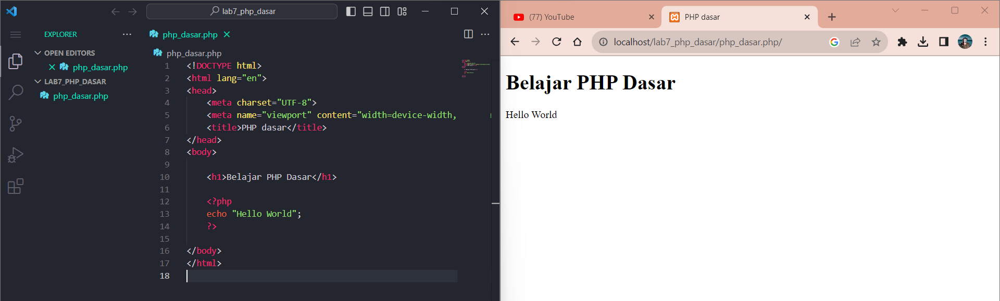

## Variabel PHP

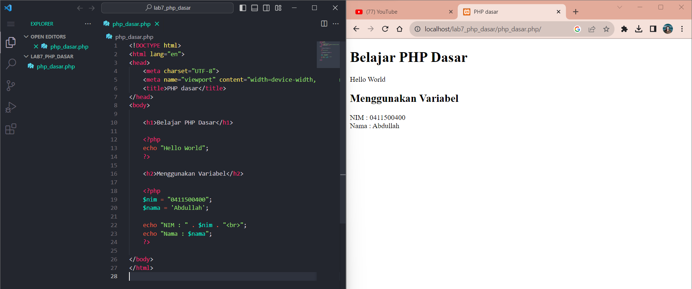

## Predefine Variable '$_GET'

Untuk mengaksesnya gunakan URL : http://localhost/lab7_php_dasar/php_dasar.php?nama=Ikhsan

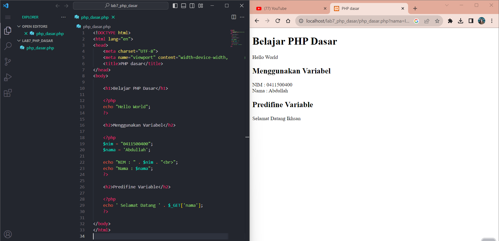

## Membuat Form Input

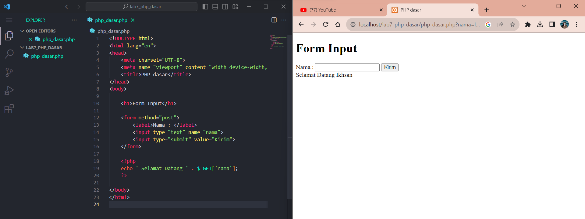

## Operator

Untuk mengaksesnya gunakan lagi URL diawal : http://localhost/lab7_php_dasar/php_dasar.php/

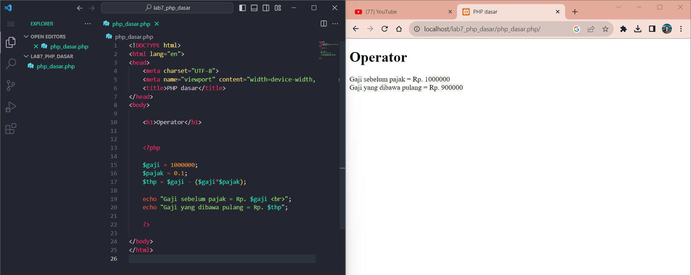

## Kondisi IF

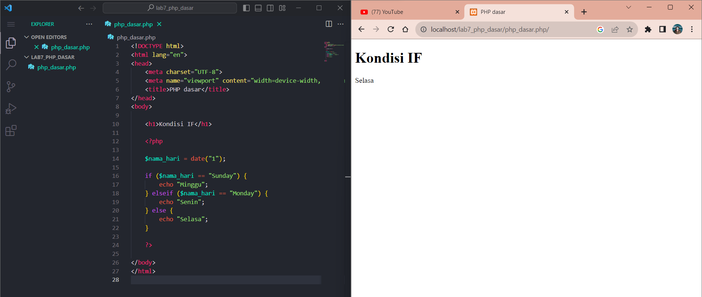

## Kondisi Switch

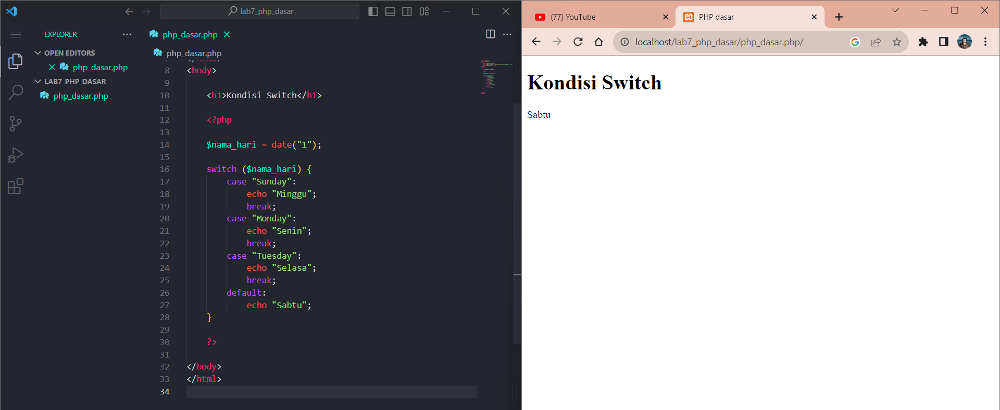

## Perulangan 'For'

## Perulangan 'While'

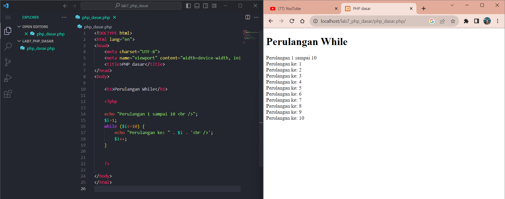

## Perulangan 'do while'

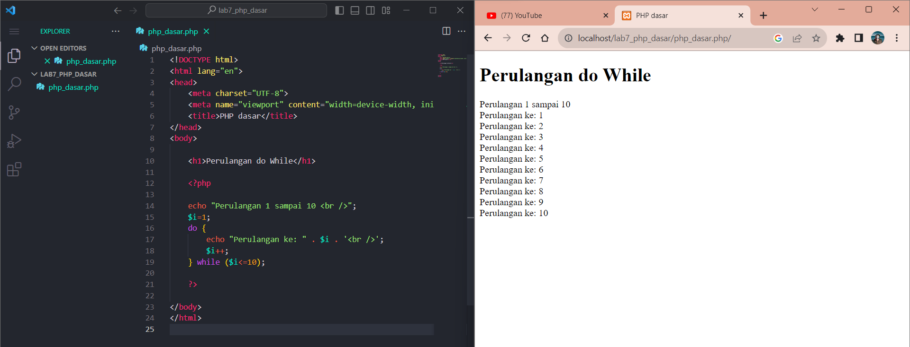

## Pertanyaan dan Tugas

Buatlah program PHP sederhana dengan menggunakan ``form input yang menampilkan nama, tanggal lahir dan pekerjaan. ``

Kemudian tampilkan outputnya dengan ``menghitung umur berdasarkan inputan tanggal lahir``. Dan pilihan ``pekerjaan dengan gaji yang berbeda-beda sesuai dengan pilihan pekerjaan.``

## Jawab

- Tampilan form sebelum di isi.

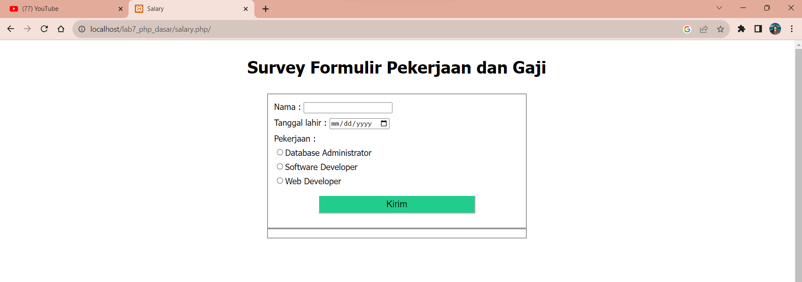

- Setelah Memilih Database Administrator 👇

- Setelah Memilih Software Developer 👇

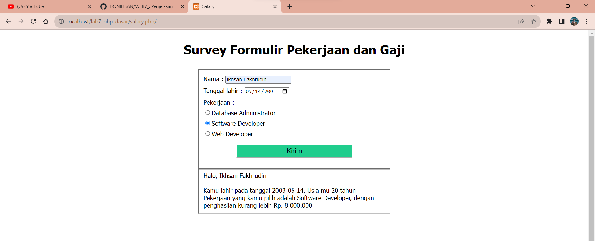

- Setelah Memilih Web Developer 👇

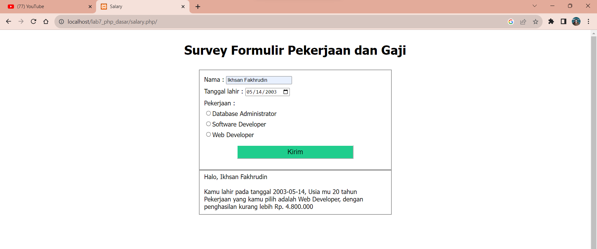

## SELESAI  
