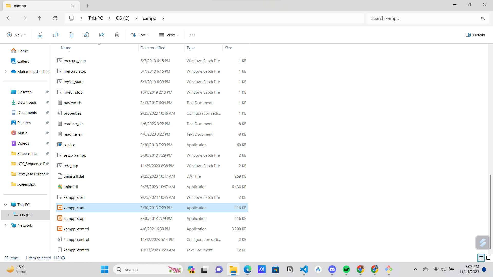
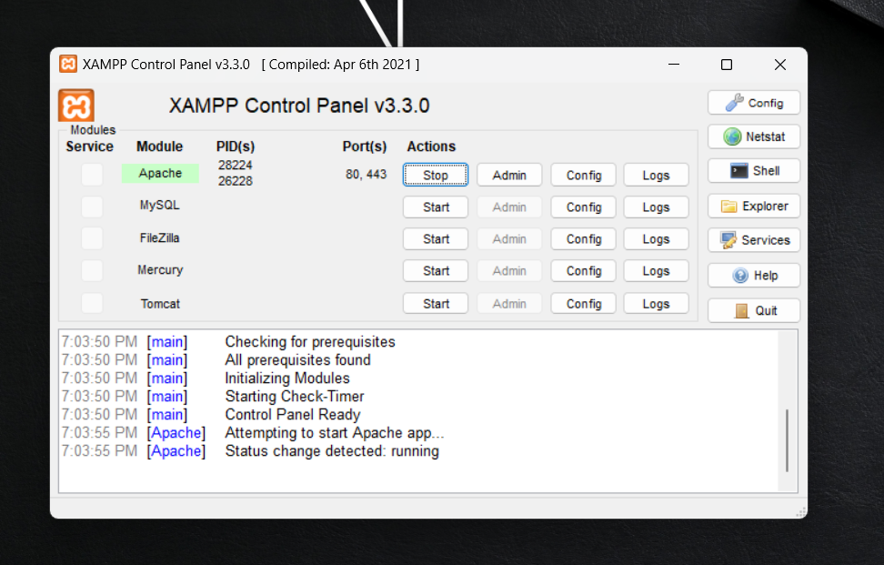
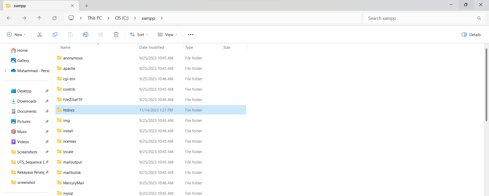
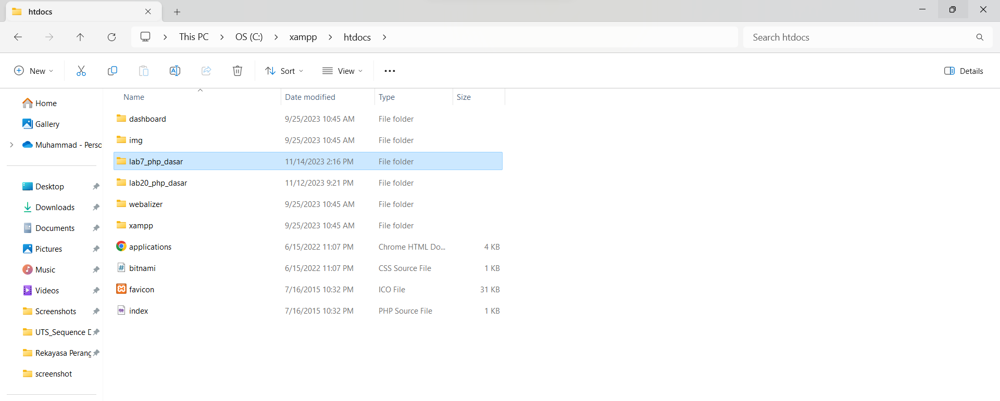
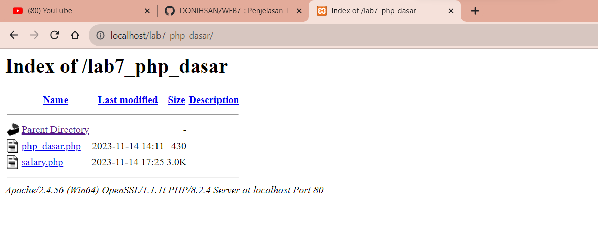
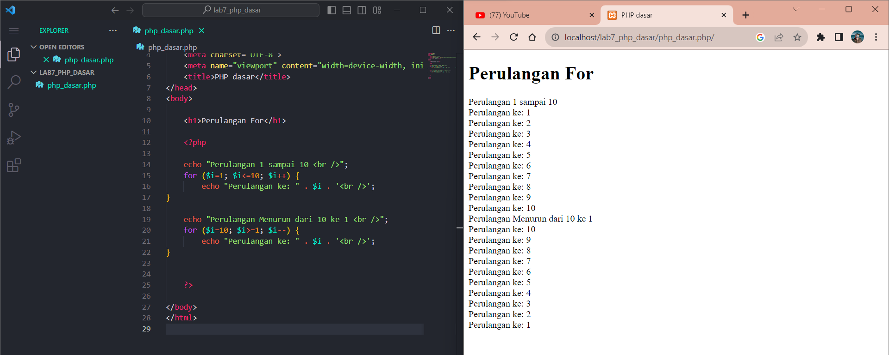

# Tugas Praktikum { Pertemuan ke 9 } 

|**Nama**|**NIM**|**Kelas**|**Matkul**|
|----|---|-----|------|
|Muhammad Ikhsan Fakhrudin|312210019|TI.22.A.2|Pemrograman Web 1|

# PHP Dasar

## Langkah-Langkah Praktikum

## 1. Install XAMPP

Install XAMPP dari https://www.apachefriends.org/download.html

## 2. Menjalankan Web Server

Berikut tampilan menu dari XAMPP Control

Menjalankan XAMPP dengan cara ``klik tombol Start pada server Apache`` seperti gambar diatas

## 3. Memulai PHP

Buat folder ``lab7_php_dasar`` pada root directory web server ***(misal : C:\xampp\htdocs).***

Kemudian untuk mengakses direktory tersebut pada web server dengan mengakses URL : http://localhost/lab7_php_dasar/

## 4. PHP Dasar 

Membuka ``text editor`` , di sini saya menggunakan ***Visual Studio Code.***

Membuka folder ``lab7_php_dasar``

Membuat file baru dengan nama ``php_dasar.php``. Kemudian buat kode seperti berikut.

Untuk mengaksesnya gunakan URL : http://localhost/lab7_php_dasar/php_dasar.php/

## Variabel PHP

## Predefine Variable '$_GET'

Untuk mengaksesnya gunakan URL : http://localhost/lab7_php_dasar/php_dasar.php?nama=Ikhsan

## Membuat Form Input

## Operator

Untuk mengaksesnya gunakan lagi URL diawal : http://localhost/lab7_php_dasar/php_dasar.php/

## Kondisi IF

## Kondisi Switch

## Perulangan 'For'

## Perulangan 'While'

## Perulangan 'do while'

## Pertanyaan dan Tugas

Buatlah program PHP sederhana dengan menggunakan ``form input yang menampilkan nama, tanggal lahir dan pekerjaan. ``

Kemudian tampilkan outputnya dengan ``menghitung umur berdasarkan inputan tanggal lahir``. Dan pilihan ``pekerjaan dengan gaji yang berbeda-beda sesuai dengan pilihan pekerjaan.``

## Jawab

- Tampilan form sebelum di isi.

- Setelah Memilih Database Administrator 👇

- Setelah Memilih Software Developer 👇

- Setelah Memilih Web Developer 👇

## SELESAI  
